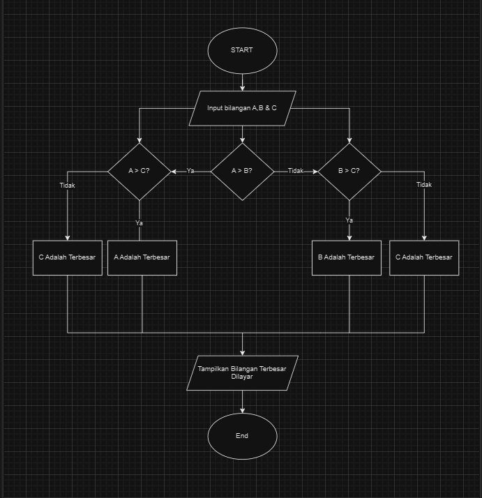
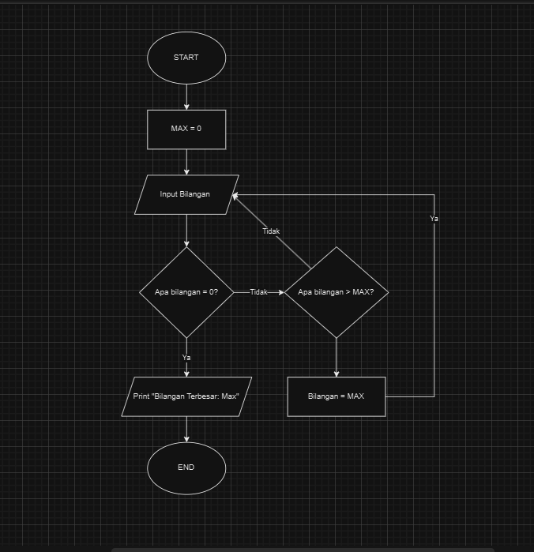

# 1. Program Mencari Bilangan Terbesar Dari 3 Bilangan
Program sederhana untuk mencari nilai terbesar dari 3 bilangan yang diinputkan.

## Rincian Program
program ini ditulis menggunakan bahasa python dan memiliki fungsi sebagai berikut:

- Menggunakan 'int' untuk mendefinisikan input.
- Memanfaatkan fungsi 'if' untuk membuat skenario pengeliminasi fungsi pad input.
- Memanfaatkan fungsi 'else' jika skenarionya adalah sebaliknya.

## Flowchart


## Code Mencari Bilangan Terbesar Dari 3 Bilangan
````
a = int(input("Masukkan bilangan A: "))
b = int(input("Masukkan bilangan B: "))
c = int(input("Masukkan bilangan C: "))

if a > b:
    if a > c:
        print("Bilangan A adalah terbesar")
    else:
        print("Bilangan C adalah terbesar")
else:
    if b > c:
        print("Bilangan B adalah terbesar")
    else:
        print("Bilangan C adalah terbesar")
````

## Contoh Tampilan Output 
````
Masukkan bilangan A: 20
Masukkan bilangan B: 87 
Masukkan bilangan C: 59
B adalah terbesar
Bilangan terbesar adalah: 87
````

## Penjelasan Code

Program ini menjelaskan bilangan terbesar dari 3 bilangan yang di input oleh user dengan cara:

inputkan bilangan A, B, C setelah masukan bilangan kemudian, cek bilangan mana yg memiliki nilai terbesar

A > B? if yes (bilangan terbesar adalah A) kemudian A > C if yes bilangan terbesar adalah A If no (bilangan terbesar adalah c)

B > A? if yes (bilangan terbesar adalah B) kemudian B > C if yes bi;amgan terbesar adalah B if no (bilangan terbesar adalah C).


# 2. Program Mencari Bilangan Terbesar Menggunakan Looping Sederhana
Program sederhana untuk mencari nilai terbesar dari sekumpulan bilangan yang diinputkan menggunakan looping sederhana menggunakan while dan break statement.

## Rincian Program

Program ini ditulis dalam bahasa Python dan memiliki fitur sebagai berikut:

- Menggunakan loop while True untuk perulangan yang tidak terbatas
- Memanfaatkan pernyataan break untuk mengakhiri eksekusi program
- Membandingkan setiap masukan dengan nilai maksimum yang sudah ada
- Menampilkan bilangan tertinggi yang berhasil ditemukan
  

## Flowchart


## Code
````
a = 0
bilangan = int(input("Masukkan bilangan: "))
while bilangan != 0:
    if bilangan > a:
        a = bilangan
    bilangan = int(input("Masukkan bilangan: "))
    
print(f"Bilangan terbesar {a}")
````
## Contoh Output
````
Input angka (0 untuk keluar): 2
Input angka (0 untuk keluar): 3
Input angka (0 untuk keluar): 6
Input angka (0 untuk keluar): 8
Input angka (0 untuk keluar): 1
Input angka (0 untuk keluar): 9
Input angka (0 untuk keluar): 0
Angka terbesar: 9
````
## Penjelasan Code

Cara Kerja Program Inisialisasi: Program mulai dengan nilai_terbesar diset ke None.

Loop: Program berjalan dalam loop tanpa batas.

Input:Program meminta pengguna memasukkan angka. Jika pengguna memasukkan 0, program berhenti.

Pembaruan: Jika angka lebih besar dari nilai_terbesar, program memperbarui nilai_terbesar. Output: Setelah keluar dari loop, program menampilkan angka terbesar yang ditemukan, atau pesan jika tidak ada angka yang dimasukkan.


